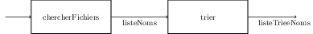

# BE3 - Programmation thread et synchronisation par sémaphore / mutex

Le programme `trier` fourni permet de trier par ordre alphabétique les
noms des fichiers contenus dans un répertoire et ses sous-répertoires.
Il est composé de deux sous-programmes, l'un recherchant tous les noms
de fichiers et les plaçant, dans l'ordre ou il les trouve, dans une
liste ; l'autre extrayant les noms de cette liste et les plaçant dans
une autre liste, triée.

Il vous est demandé de décomposer ce programme en deux threads
communiquant par la liste intermédiaire (non triée).

Pour cela, vous devrez créer de nouvelles versions de certains des
fichiers qui vous sont fournis :

-   `liste-noms.h` et `liste-noms.c` sont une implantation élémentaire
    d'une liste de chaînes de caractères ;

-   `liste-triee-noms.h` et `liste-triee-noms.c` sont une implantation
    d'une liste triée de chaîne de caractères ;

-   `trier.c` est la version non parallélisée du programme ;

-   `Makefile` vous permet de compiler correctement vos programmes.

Il faudra naturellement intégrer dans certains de ces fichiers la
gestion du parallélisme. Les fichiers intégrant la gestion du
parallélisme ont été créés pour vous (leur nom se termine par `-mt`). Ce
sont des copies des fichiers listes ci-dessus. Nous vous conseillons de
les utiliser car le `Makefile` utilise ces noms pour la compilation du
programme `trier-mt`.

Le but de ce BE est de traiter intégralement un problème de
synchronisation de threads.

## Travail préliminaire

Comme pour le BE2, les fichiers nécessaires au déroulement du BE se
trouvent sous Github. Pour les récupérer, exécutez la commande :

``` {.bash language="bash"}
git clone https://github.com/ermont/tri-fichiers.git
```

Vous devriez obtenir un répertoire `tri-fichiers` dont l'arborescence
est la suivante :

```bash
tri-fichiers
├── Makefile
├── README.md
├── SAVE
│   └── tri-fichier.o
├── liste-noms-mt.c
├── liste-noms-mt.h
├── liste-noms.c
├── liste-noms.h
├── liste-triee-noms.c
├── liste-triee-noms.h
├── nom.h
├── tri-fichier.h
├── trier-mt.c
└── trier.c
```

## Le problème

Le programme `trier.c` dont le listing est donné ci-après permet
d'afficher les noms de tous les fichiers contenus dans un répertoire (et
ses sous-répertoires), ces noms étant affichés dans l'ordre
alphabétique. Les modules `liste-noms` et `liste-triee-noms` définissent
et implémentent les types `ListeNoms` et `ListeTrieeNoms` ainsi que les
sous-programmes associés.

```c
    /**
     * @brief Classement dans l'ordre alphabérique des noms de 
     * fichiers contenus dans un répertoire et ses sous-répertoires.
     * 
     * Utilisation : trier <répertoire>
     * 
     * @author E. Chaput
     * @date 10/2000
     */

    #include <stdio.h>
    #include <stdlib.h>   /* malloc */
    #include <string.h>

    #include <tri-fichier.h>

    int main(int argc, char * argv[])
    {
       RechercheNomsFichiers   recherche;
       ListeTrieeNoms        * listeTriee;

       /* Initialisation de la structure de recherche */
       recherche.liste = creerListeNoms();

       /* Traitement des paramètres */
       if (argc == 2) {
          recherche.nomRepertoire = argv[1];
       } else {
          printf("Usage : %s <répertoire>\n", argv[0]);
          exit(1);
       }

       /* On remplit la liste */
       chercherFichiers(&recherche);

       /* On trie */
       listeTriee = trier(recherche.liste);

       /* On affiche la liste triée */
       afficherListeTrieeNoms(*listeTriee);

       return 0;
    }
```

La structure de ce programme, illustrée par la figure
suivante, est très simple : le sous-programme `chercherFichiers` effectue une
recherche récursive des noms de fichiers en parcourant les répertoires
concernés. Le résultat de cette recherche est **inséré** dans une
`ListeNoms` (qui n'est pas triée). Ensuite, le sous-programme `trier`
**extrait** les noms de cette liste non triée et les place dans une
liste, triée celle-ci.



Le choix d'une telle structure de programme peut laisser perplexe, mais
elle fait clairement apparaître une possibilité d'optimisation du
programme. Demandons-nous en effet comment notre programme « occupe le
temps ». La recherche des noms de fichiers ne consomme pas de temps
processeur (ou de façon non significative), en revanche, elle est forte
consommatrice de temps du fait des attentes d'entrées/sorties impliquées
par les nombreux accès disques. Le tri quant à lui consomme
exclusivement du temps processeur, et ce éventuellement en grande
quantité si la liste à trier est longue. Il parait alors possible de
paralléliser ces deux activités, consommatrices de temps pour des
raisons différentes. Pendant l'attente d'une lecture sur disque, le
processeur peut en effet trier les noms déjà découverts.

## Premier essai

Compilez le programme à l'aide du fichier `Makefile` 
```bash
make
```
et exécutez le :
```bash
./trier ~
```

## Utilisation des threads

Nous allons donc réécrire notre programme de tri afin de faire réaliser
chacune des deux opérations (recherche puis tri) par un thread distinct.

### Création des threads

> **Création d'un thread**
> 
> `int pthread_create(pthread_t *tid, pthread_attr_t * attr, void * (*start_routine)(void *), void * arg);`
> -   `tid` : identifiant du thread, fourni par le système
> -   `attr` : configuration du thread, `NULL` = configuration par défaut
> -   `start_routine` : la fonction exécutée par le thread
> -   `arg` : valeur de l'argument de la fonction, `NULL` si pas
    d'argument.
>

La création des threads est très simple, il faut déclarer les
identifiants des threads :
```c
    pthread_t tidTri, tidRech; /* identificateurs des threads */
```
puis remplacer les deux lignes d'appel aux sous-programmes par le
lancement de thread, par exemple :
```c
    /* On lance le thread qui remplit la liste */
    if ((erreur= pthread_create(&tidRech, NULL, (ThreadMain)chercherFichiers, &recherche)) != 0) {
        fprintf(stderr, "[%s] erreur pthread create\n", strerror(erreur));
        exit(EXIT_FAILURE);
    }
```

Modifiez le programme `trier-mt.c` de manière à créer 2 threads :

-   un thread qui exécute la recherche ;

-   un thread qui effectue le trie de la liste de fichiers trouvée.

Testez l'exécution du programme avec ces 2 threads.

### Attente de la terminaison des threads

> **Attente de la terminaison des threads**
> 
> `int pthread_join(pthread_t tid, void **thread_return);`
> -   `tid` : identifiant du thread à attendre
> -   `thread_return` : valeur de retour du thread, `NULL` si pas de
    retour.
>

A ce stade, les threads s'exécutent en parallèle. La primitive
`pthread_join` permet d'attendre la terminaison des threads. La valeur
de retour du thread est alors transmis via l'argument `thread_return`.
Par exemple :
```c
    if ((erreur= pthread_join(&tidTri, (void *) &listeTriee)) != 0) {
        fprintf(stderr, "[%s] erreur pthread join\n", strerror(erreur));
        exit(EXIT_FAILURE);
    } 
```
Ici, le thread `tidTri` retourne une `listeTriee` de noms de fichiers.

Modifiez le programme `trier-mt.c` de manière à attendre la terminaison
des 2 threads créés précédemment.

### Synchronisation

Une synchronisation est nécessaire entre les deux threads afin d'assurer
que l'accès aux ressources partagées se fasse de façon cohérente. La
seule ressource partagée ici est la liste dans laquelle un producteur
(le thread qui exécute `chercherFichiers`) écrit pendant qu'un
consommateur (le thread qui exécute trier) lit.

Nous allons donc associer des outils de synchronisation au type
`listeNoms` afin de permettre l'utilisation de structures de ce type
dans une application multithreadée.

Pour cela, nous devons identifier les problèmes de synchronisation que
peut soulever une telle utilisation.

#### Accès à la liste.

L'insertion et l'extraction d'un élément dans et depuis la liste
nécessite une exclusion mutuelle ; en effet, ces différents
sous-programmes manipulent la structure `listeNoms`.

> **Exclusion mutuelle - mise en place d'un verrou**
>
> `pthread_mutex_t verrou;`
> -   Initialisation directe : `verrou= PTHREAD_MUTEX_INITIALIZER;`
> -   ou bien : `int pthread_mutex_init(pthread_mutex_t *verrou, const pthread_mutexattr_t *mutexattr);`
> -   `mutexattr` permet de définir les options associées à la
        variable ; option par défaut : `NULL`
        
> `int pthread_mutex_lock(pthread_mutex_t *verrou);` : verrouillage --
entrée en section critique\
> `int pthread_mutex_unlock(pthread_mutex_t *mutex);` : déverrouillage --
sortie de la section critique

Modifier les fichiers `liste-noms-mt.h` et `liste-noms-mt.c` de façon à
protéger les accès concurrents à une liste de noms.\
Testez le (bon ?) fonctionnement du programme.

#### Qu'est-ce qu'une liste vide ?

Étant donnés les accès « simultanés » des producteurs et des
consommateurs à la liste, il est tout à fait possible qu'un consommateur
essaie d'extraire un élément de la liste alors qu'elle est physiquement
vide, mais qu'un producteur ait encore des informations à y insérer.

Quel doit alors être le comportement de l'application face à cette
situation ?

En fait, la question que nous devons nous poser (et à laquelle nous
devons répondre !) est plus précisément « Quand considère-t-on que la
liste est vide ? ».

En effet, si la réponse à cette question avait l'air évidente dans la
première version de notre programme, elle ne l'est plus tout à fait
autant maintenant.

Nous y apporterons la réponse suivante. Une liste est vide lorsque les
deux conditions suivantes sont remplies :

-   il n'y aucun élément dans la liste ;

-   il n'y a plus de producteur susceptible d'y insérer des données.

La première condition est relativement simple à identifier grâce à la
structure même de la liste.

Pour pouvoir identifier la seconde, il nous faut comptabiliser les
producteurs. Pour cela, il suffit de mettre en place un compteur de
nombre de producteurs, `int nbProducteurs;`, initialisé à zéro puis
incrémenté par chaque thread avant toute utilisation de sous-programmes
d'insertion, puis décrémenté lorsque aucune insertion n'est plus
nécessaire. Il faut ajouter au module `liste-noms-mt` les deux
sous-programmes suivants :
```c
    void ouvrirListeNoms(ListeNoms * f);
    /*
     * Ce sous-programme doit etre utilisé par tout producteur avant
     * toute autre manipulation de la liste afin de s'identifier.
     */
    void fermerListeNoms(ListeNoms * f);
    /*
     * Ce sous-programme doit etre utilisé par tout producteur lorsqu'il
     * a fini d'utiliser la liste.
     */
```

Modifiez les fichiers `liste-noms-mt.h` et `liste-noms-mt.c` de manière
à ajouter les deux sous-programmes `ouvrirListeNoms` et
`fermerListeNoms` spécifiés ci-dessus.
Modifiez aussi le sous-programme `listeNomsVide` pour prendre en compte
le nombre de producteurs toujours présents.

#### Disponibilité des données.

La deuxième question à se poser concerne la disponibilité des données.
Il s'agit ici de savoir ce que doit faire un consommateur qui invoque
par exemple la procédure `extraireNom` sur une liste vide. En effet, si
nous regardons l'interface de l'extraction depuis une liste, nous
trouvons :
```c
    void extraireNom(ListeNoms * f, Nom * nom);
    /*
     * Extraction du premier élément de la liste.
     *
     * Nécessite
     * !listeNomsVide(*f)
     */
```
Il devient malheureusement impossible pour un thread d'assurer la
précondition lors d'un tel appel. Ainsi une portion de code telle que :
```c
    ...
    if (!listeNomsVide(*liste)) {
    extraireNom(liste, &nom);
    ...
    }
    ...
```
ne garanti en rien que l'invocation de `extraireNom` ne se fera pas sur
une liste vide. Nous nous trouvons en effet face au problème classique
de la non-atomicité du couple d'opérations test/modification.

Il est donc nécessaire de fournir dans le module `ListeNoms` une telle
opération atomique pour un bon fonctionnement. Une solution est par
exemple de supprimer la précondition à `extraireNom` et de faire que ce
sous-programme, lorsqu'il est appelé sur une liste vide, fournisse un
nom `NULL`. On obtient donc par exemple le code (partiel, disponible
dans `liste-triee-mt.c`) suivant :
```c
    void extraireNom(ListeNoms * f, Nom * nom)
    {
        CelluleNom * cv; // Cellule vidée à détruire
        ...
        /* On va supprimer le premier */
        cv = f->premier;
        /* Son suivant devient le premier */
        if (f->premier != NULL) {
            *nom = f->premier->nom;
            f->premier = f->premier->suivant;
        } else {
            *nom = NULL;
        }
    ...
    }
```

#### Attente active.

Étant données les modifications que nous venons d'apporter à notre
liste, un thread qui souhaite consommer des éléments de la liste tant
que celle-ci n'est pas vide doit avoir un comportement tel que ce qui
suit
```c
    while (!listeNomsVide(*liste)) { 
                                  // Tant que la liste n'est pas vide ...
        extraireNom(liste, &nom); // ... j'extrai le premier élément.
        if (nom != NULL) {        // Si j'ai bien obtenu un élément ...
        ...                       // ... je l'utilise.
        }
    }
```
C'est-à-dire que notre thread consommateur risque de faire une attente
active.

Pour éviter cela, nous allons ajouter à notre liste une variable
condition permettant un blocage (dans `extraireNom`) et donc une attente
passive lorsque la liste est non vide mais qu'aucune donnée n'est
disponible.

> **Variable condition et attente passive**
> 
> `pthread_cond_t condition;`
> -   Initialisation :\
    `int pthread_cond_init(pthread_cond_t *condition, pthread_condattr_t *cond_attr);
> -   `cond_attr` : configuration de la condition ; `NULL` = options par
    défaut

> `int pthread_cond_wait(pthread_cond_t *condition, pthread_mutex_t *mutex);`
: attente que la condition soit réalisée\
> `int pthread_cond_signal(pthread_cond_t *condition);` : réveil d'un
thread en attente de la condition

Modifiez les sous-programmes `extraiteNoms` et `insererNom` de manière à
éviter l'attente active des consommateurs, c'est-à-dire à ne réveiller
le thread de tri uniquement lorsqu'une données est disponible dans la
liste de noms. Pourquoi est-il également nécessaire de modifier
`fermerListeNoms` ?

### Prise en compte dans le programme

Revenons à notre problème spécifique. Après avoir lancé les deux
threads, le programme principal doit simplement attendre qu'ils se
terminent puis afficher le résultat.

Cependant, il faut également penser à ouvrir et fermer la liste pour le
consommateur.

Étant donnée la structure récursive de `chercherFichiers`, il est ici
plus simple de placer ces actions respectivement avant le lancement du
thread, et après l'attente de sa terminaison.

\
Modifiez le programme principal de sorte que le nombre de producteurs
soit correctement connu par la liste de noms en utilisant les appels aux
sous-programmes `ouvrirListeNoms` et `fermerListeNoms`.

## Etude des performances

La commande Unix `time` permet de mesurer le temps pris par un processus
lors de son exécution. Le tableau [1](#tab:eval){reference-type="ref"
reference="tab:eval"} compare les temps d'exécution des deux versions de
notre programme appliquée sur trois répertoires différents.

  -------------- -------------- ------- ------ -------------- ------- ------ -------------- ------ ------
                  Répertoire 1                  Répertoire 2                  Répertoire 3         
                      real       user    sys        real       user    sys        real       user   sys
    Un thread        55.17       16.13   1.84      90.82       40.44   2.03      16.44       1.82   0.40
   Deux threads      41.84       17.56   2.15      63.59       41.94   4.33      15.27       2.14   0.63
  -------------- -------------- ------- ------ -------------- ------- ------ -------------- ------ ------

  **Table 1** : Temps d'exécution de `trier` et `trier-mt` pour 3 répertoires différents

Ce tableau nous montre que le temps « réel » est sensiblement plus court
pour le programme multithreadé. Les temps passés dans le système et en
mode utilisateurs sont un peu plus longs en revanche, ceci est le
surcoût dû à la manipulation des mécanismes de synchronisation. Il faut
faire attention, en réalisant de tels tests, à se placer dans des
conditions parfaitement similaires pour les deux programmes, notemment
vis à vis des caches qui peuvent fausser les résultats.


Testez le temps d'exécution du programme `trier-mt` que vous avez
réalisé et comparez le à celui du programme `trier`.
